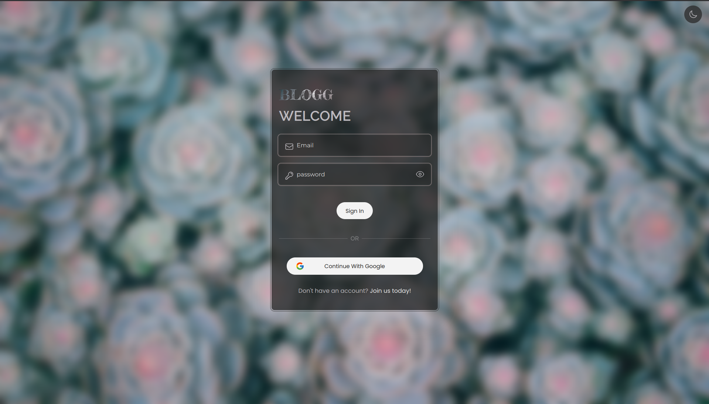
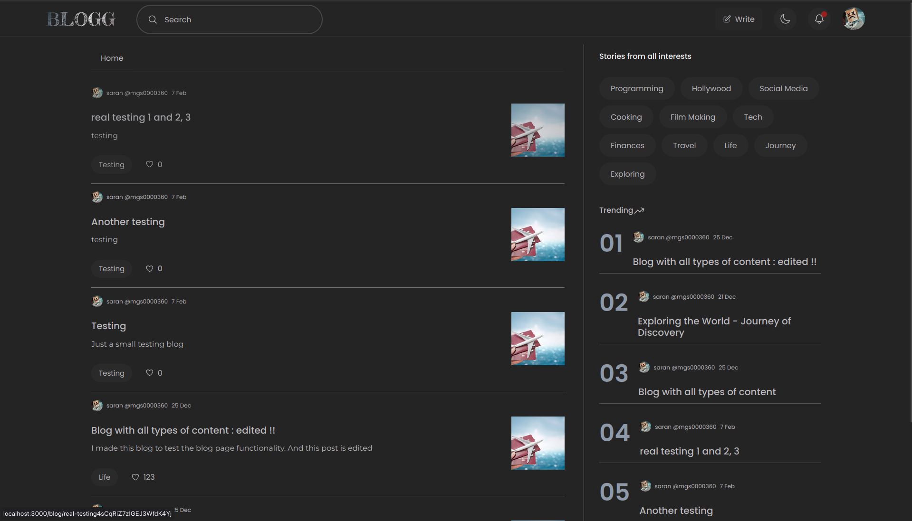
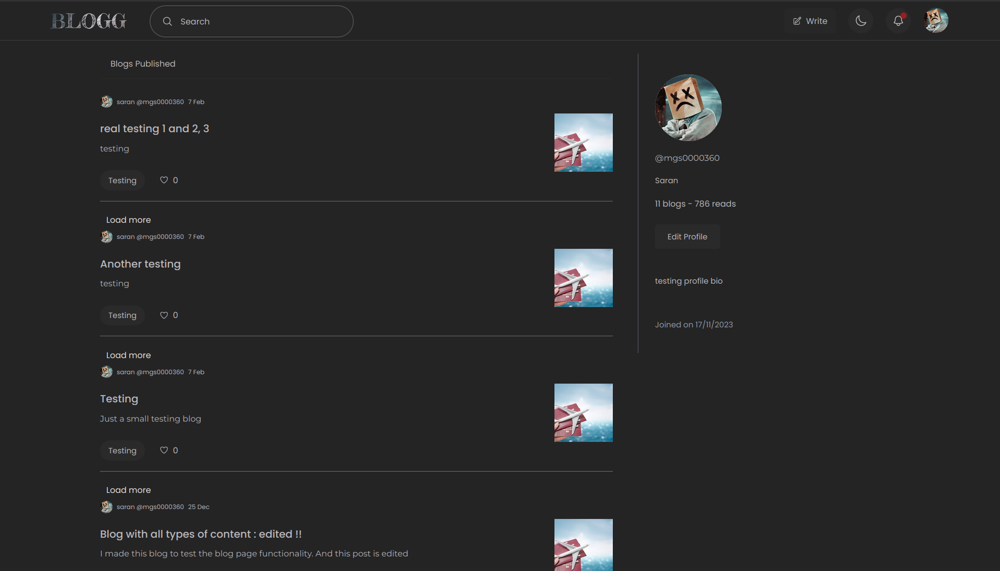
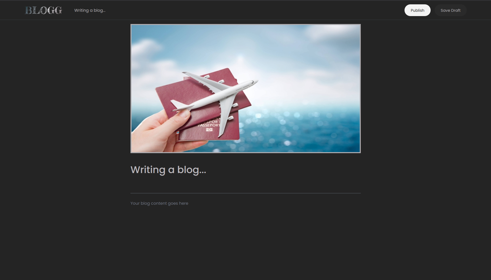

# BLOGG

Its a blogging platform, I created this mainly to learn NEXT.js, TailwindCSS.

This repo contains the frontend part of the project.

## Technologies used

- **NEXT.js 14**
- **TailwindCSS**
- **Editor.js**
- **million.js**
- **Framer motion**

## Images

Account Sign in and Sign up page

Home page

user profile page

Blog Editor page

Search page.

