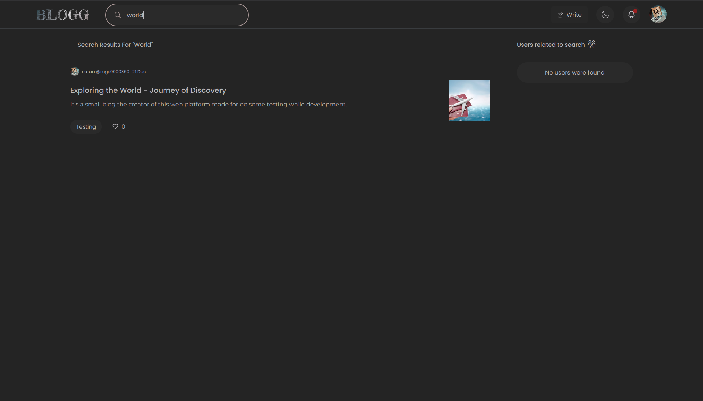

# [BLOGG](https://bloom-blogging.onrender.com)

Its a blogging platform, I created this mainly to learn NEXT.js, TailwindCSS.

This repo contains the frontend part of the project.

## Technologies used

- **NEXT.js 14**
- **TailwindCSS**
- **Editor.js**
- **million.js**
- **Framer motion**

## Images

Account Sign in and Sign up page

Home page

user profile page

Blog Editor page

Search page.

##### [Project Link](https://bloom-blogging.onrender.com) - I've hosted this web app on render under free plan so it will fall asleep if no one's accessing the server, if you are accessing the web app it may take some time to load for you depending on your network speed and your location.

##### I did my best to make it load faster.
